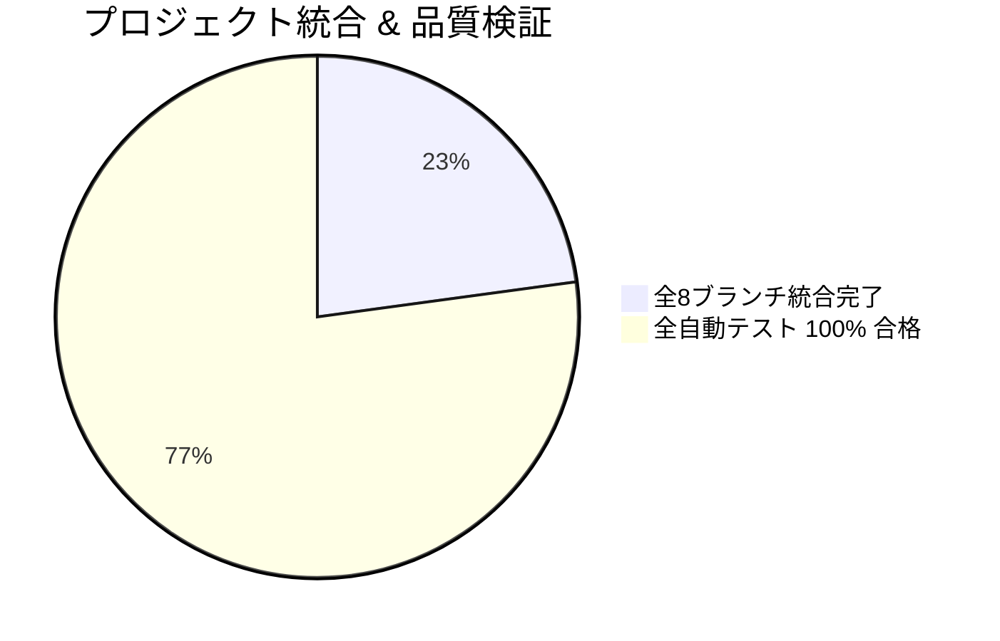

# 📌 ブランチ統合・バグ修正・機能追加状況管理シート (Branch Status)

**最終更新日時:** 2026-09-03 10:21  
**メインリポジトリ:** [maho011933/tizu1](https://github.com/maho011933/tizu1)  
**現在のベース:** `main` (`e57a142`)

---

## 🗺️ 統合・品質サマリー

- **ブランチ統合進捗率:** **8 / 8 担当 (100% 統合完了！🎉)**
- **バックエンドテスト:** **8 / 8 件 PASS (100%)**
- **フロントエンドテスト:** **19 / 19 件 PASS (100%)**
- **TypeScript型チェック & 本番ビルド:** **エラー 0 件 (成功)**

---

## 🌟 今回追加された新機能

1. **危険度（レベル1〜5）に応じたマーカーの動的サイズ変更**:
   - Lv.1 (24px) 〜 Lv.5 (50px) まで危険度に応じてピンの大きさとフォントサイズを動的に拡大
   - Lv.4〜5の高危険度ピンには「⚠️ Lv.4/5」バッジと点滅・アラートアニメーションを追加
2. **ヒートマップ表示機能 (Heatmap Layer)**:
   - ヘッダーに「🔥 ヒートマップ (ON/OFF)」切り替えトグルボタンを追加
   - 危険度に応じた多重グラデーションサーマルサークル（赤・橙・黄）をマップ上に可視化
   - 画面左下にわかりやすいヒートマップ凡例（Legend）を表示

---

## 🟢 `main` に連結（マージ）完了した全ブランチ一覧

| PR番号 | ブランチ名 | 担当・役割 | マージされた機能・実装内容 |
| :---: | :--- | :--- | :--- |
| **#9** | **`nonntann`** | Bさん (現在地/PWA) | **現在地トラッキング・PWA機能** ・現在地の動的アイコン表示・歩行アニメーション・方位表示・アバター選択 ・PWA対応（Service Worker / スマホアプリ化） ・危険箇所接近時のバックグラウンド追跡・アラート通知 |
| **#8** | **`kokona`** | Fさん (オープンデータ/GIS) | **オープンデータ連携・避難所案内** ・天童市オープンデータ連携（避難所・AED・こども安心スポット等） ・最寄り避難所/AED近傍検索API & ワンタップ案内UI ・データETLパイプラインスクリプト整備 |
| **#7** | **`aya`** | Dさん (ジオクエリ/通知) | **空間演算API・接近通知・統計** ・PostGISによる半径Xm以内危険箇所取得API ・リアルタイム接近アラート通知トリガーAPI (SSE) ・エリア別危険度統計API |
| **#6** | **`PM`** | PM (進行/UX) | **テストキット・ユーザーフィードバック** ・子供/保護者向けユーザーテスト実施キット (`USER_TEST_KIT.md`) ・アプリ内フィードバック収集モーダル & デザインガイドライン (`DESIGN_GUIDELINE.md`) |
| **#5** | **`ayu`** | Cさん (DB/コアAPI) | **DB基盤・クラウドストレージ連携** ・PostgreSQL + PostGIS 空間データベース環境 (`docker-compose.yml`, `init.sql`) ・AWS S3 / Cloudinary 画像保存モジュール (`storageService.ts`) |
| **#4** | **`haru`** | Eさん (AI/Gemini) | **Gemini AI自動解析・あんぜんアドバイス** ・AIによる投稿内容の自動判定（危険度・カテゴリ分類） ・子供向け「AIあんぜんアドバイス」生成モジュール (`geminiService.ts`, `aiRoutes.ts`) ・APIキーバリデーション & フォールバック処理 |
| **#3** | **`rima`** | Aさん (UI/マップ) | **子供向けUI・マップ可視化機能** ・ひらがな主体の親しみやすいUI・イラスト風ピン ・危険度別ピンサイズ、ヒートマップ表示、絞り込みフィルター |
| **#2** | **`manato`** | Gさん (DevOps/QA) | **Docker環境・CI/CD・テスト自動化** ・Docker Compose設定、GitHub Actions CI/CD ・ピン表示・フォーム動作の自動テストコード |
| - | **`cyokotippu`** / **`maho`** / **`ここな`** | メンバー | 初期コミット状態（差分なし） |
