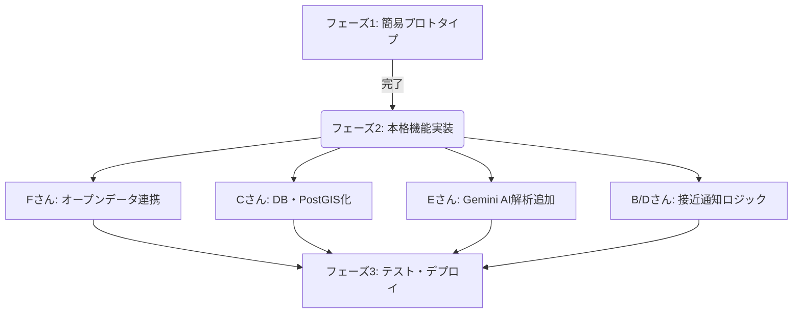

# みんなの安全マップ 開発タスク＆役割分担表

本ドキュメントは、8人チームでの「みんなの安全マップ」開発における役割ごとの詳細タスクと進捗状況を管理するための作業用シートです。
現在のプロトタイプ実装（Express + `hazards.json`による簡易保存）から、本来設計したいシステム（PostgreSQL/PostGIS、Gemini API連携、バックグラウンド位置情報・通知機能など）への移行を見据えた詳細なタスク一覧を定義しています。

---

## 🗺️ 開発フェーズと現在地

現在、プロジェクトは **「フェーズ1：プロトタイプ（簡易API + 地図表示）の動作確認」** が完了し、**「フェーズ2：本実装（データベース化、Gemini AI連携、位置情報通知の導入）」** に入る段階です。

---

## 👥 役割ごとの詳細タスク一覧 (Todo & Status)

### 1. プロジェクトマネージャー (PM) 兼 プロダクトオーナー
**主な任務:** 全体の進捗管理、要件定義、タスク調整、UI/UXの基本設計。

| タスク内容 | 優先度 | 進捗 | 備考 |
| :--- | :---: | :---: | :--- |
| 要件定義書の策定とスコープの管理 | 高 | 🟢 完了 | 基本機能の選定完了 |
| ひらがな多めの子供向けデザインガイドライン策定 | 中 | 🟡 進行中 | UI/UXの改善方針を策定中 |
| 各開発メンバー間の進捗・連携調整（週次ミーティング等） | 中 | 🔄 継続 | 進捗のトラッキング |
| ユーザーテスト（子供・保護者）の計画とフィードバック収集 | 低 | 🔴 未着手 | フェーズ3で実施予定 |

---

### 2. フロントエンドエンジニア (UI & マップ可視化)
#### **Aさん：メインUI & マップ実装**
*   **現在の状況:** React Leafletを使った地図表示、カテゴリごとのピン色分け表示、投稿・編集用モーダルフォームの基礎を構築済み。

| タスク内容 | 優先度 | 進捗 | 備考 |
| :--- | :---: | :---: | :--- |
| 地図上のマーカーアイコンを子供向けデザイン（イラスト風）に変更 | 高 | 🟡 進行中 | [App.tsx](file:///C:/Users/denshi36/Desktop/maho/frontend/src/App.tsx#L27-L49) の `getMarkerIcon` を更新 |
| 危険カテゴリ（交通、防犯、災害、街灯、その他）の絞り込みフィルター実装 | 高 | 🔴 未着手 | マップ上にフィルターボタンを配置 |
| 危険度（レベル1〜5）に応じたマーカーのサイズ変更やヒートマップ表示 | 中 | 🔴 未着手 | Leafletのヒートマッププラグイン等の検討 |
| 新規投稿・編集時のバリデーションと子供向けエラー表示（ひらがな） | 中 | 🟡 進行中 | バリデーションエラーメッセージの最適化 |

#### **Bさん：現在地・通知機能 & 状態管理**
*   **現在の状況:** ブラウザの Geolocation API を利用した現在地取得とマップ中心移動、`localStorage` を利用した「いつものばしょ（自宅）」保存機能を実装済み。

| タスク内容 | 優先度 | 進捗 | 備考 |
| :--- | :---: | :---: | :--- |
| バックグラウンドでの位置情報取得と位置情報トラッキングの状態管理 | 高 | 🔴 未着手 | Reactの状態管理（Context or Redux等）の設計 |
| PWA（Progressive Web App）化によるモバイル実機動作の対応 | 高 | 🔴 未着手 | Service Workerの設定とマニフェスト作成 |
| 危険個所接近時のブラウザプッシュ通知 / 音声アラート機能の実装 | 高 | 🔴 未着手 | Notification APIとサウンドアセットの統合 |
| 現在地のアイコン表示（動的な移動アニメーションなど） | 中 | 🟡 進行中 | [App.tsx](file:///C:/Users/denshi36/Desktop/maho/frontend/src/App.tsx#L51-L58) の `getHomeIcon` 等と同期 |

---

### 3. バックエンドエンジニア (API & データベース)
#### **Cさん：コアAPI & DB設計**
*   **現在の状況:** `backend/server.ts` にて Express + `hazards.json` での簡易保存API（CRUD）および Multer による画像アップロード機能を実装済み。

| タスク内容 | 優先度 | 進捗 | 備考 |
| :--- | :---: | :---: | :--- |
| PostgreSQL + PostGIS データベースサーバーの選定と立ち上げ | 高 | 🔴 未着手 | ローカルでの Docker または クラウドDBの準備 |
| 危険箇所データ・ユーザーデータ・コメントデータのスキーマ設計と移行 | 高 | 🔴 未着手 | SQL定義書の作成と `hazards.json` からのデータ移行 |
| APIのデータベース接続処理の実装（JSONファイルからのリファクタリング） | 高 | 🔴 未着手 | [server.ts](file:///C:/Users/denshi36/Desktop/maho/backend/server.ts) のデータ操作処理の書き換え |
| セキュアな画像アップロード（クラウドストレージ連携等）の対応 | 中 | 🔴 未着手 | AWS S3 または GCP Cloud Storage への移行検討 |

#### **Dさん：ジオクエリ & 通知トリガー**
*   **現在の状況:** 基礎的なCRUDのみ稼働。位置情報の空間クエリは未実装。

| タスク内容 | 優先度 | 進捗 | 備考 |
| :--- | :---: | :---: | :--- |
| PostGISの空間演算（`ST_DWithin`等）を用いた「半径Xm以内の危険箇所取得API」の実装 | 高 | 🔴 未着手 | `/api/hazards/nearby?lat=...&lng=...&radius=...` の設計 |
| ユーザーの現在位置を受け取り、接近アラートを発火する通知トリガーAPI | 高 | 🔴 未着手 | WebSocketまたはSSE（Server-Sent Events）の検討 |
| エリアごとの危険度統計データ（集計結果）を返すAPIの構築 | 中 | 🔴 未着手 | 例：町丁ごとの危険報告数ランキングなど |

---

### 4. AI / Gemini 統合エンジニア
#### **Eさん：Gemini API・プロンプトエンジニアリング**
*   **現在の状況:** 未着手（テキストはそのまま保存されている）。

| タスク内容 | 優先度 | 進捗 | 備考 |
| :--- | :---: | :---: | :--- |
| Gemini APIをExpressバックエンドに統合するモジュール作成 | 高 | 🔴 未着手 | `@google/genai` または `google-generative-ai` の導入 |
| 投稿の曖昧なテキストから「危険度」「カテゴリ」「状況要約」をJSON抽出するプロンプト設計 | 高 | 🔴 未着手 | 例：「電柱の影が暗くて不審者がいそう」→ 街灯/防犯、危険度3 |
| 投稿された写真（画像）から危険物を検知・判定するマルチモーダル分析の実装 | 中 | 🔴 未着手 | 道路のひび割れや、落書き、壊れたフェンス等の自動検知 |
| APIキーのセキュアな管理と、Gemini API制限時のフォールバック処理 | 高 | 🔴 未着手 | 例：AI判定失敗時はデフォルトカテゴリ「その他」にする |

---

### 5. データ / GIS エンジニア
#### **Fさん：オープンデータ連携 & データ整備**
*   **現在の状況:** 未着手。モックデータが `hazards.json` に少数入っている状態。

| タスク内容 | 優先度 | 進捗 | 備考 |
| :--- | :---: | :---: | :--- |
| 自治体のハザードマップ（洪水、土砂災害等）や交通事故オープンデータの収集 | 高 | 🟡 進行中 | 国土数値情報や市区町村のGISデータを探す |
| 収集したCSV/GeoJSONデータをPostGISのテーブルに適合させるETLスクリプトの作成 | 高 | 🔴 未着手 | Python (pandas, geopandas) または Node.js による変換 |
| 避難所やこども110番の家などの生活安全インフラデータの初期投入 | 中 | 🔴 未着手 | 初期インポートスクリプトの実行 |

---

### 6. DevOps & QA / テストエンジニア
#### **Gさん：インフラ・CI/CD & 品質管理**
*   **現在の状況:** ローカルでの手動起動のみ。

| タスク内容 | 優先度 | 進捗 | 備考 |
| :--- | :---: | :---: | :--- |
| ローカル開発環境を統一するための Docker Compose 設定ファイルの作成 | 高 | 🔴 未着手 | `frontend`、`backend`、`postgres` の一括起動 |
| GitHub Actionsを用いた自動ビルド・リンターチェック（CI）の構築 | 中 | 🔴 未着手 | プルリクエスト時の自動CI |
| クラウド環境への自動デプロイ（CD）パイプラインの構築 | 中 | 🔴 未着手 | GCP/AWS/Render等へのホスティング設定 |
| マップのピン表示や投稿フォーム of 動作テストコード作成とバグ管理 | 高 | 🔴 未着手 | Playwright または Cypress を用いたE2Eテスト |

---

## 📅 今後の開発スケジュール

1. **フェーズ2・前半 (Cさん, Eさん, Aさん中心)**
   * データベースの構築（Cさん）
   * Gemini APIによる自動タグ付けの実装（Eさん）
   * マップ表示のリファクタリングとデザイン適用（Aさん）
2. **フェーズ2・後半 (Bさん, Dさん, Fさん中心)**
   * 位置情報接近通知機能の結合（Bさん, Dさん）
   * オープンデータの投入（Fさん）
3. **フェーズ3 (Gさん, 全員)**
   * クラウドへのテストデプロイ（Gさん）
   * 総合バグ修正、テスト、リリース調整（全員）
